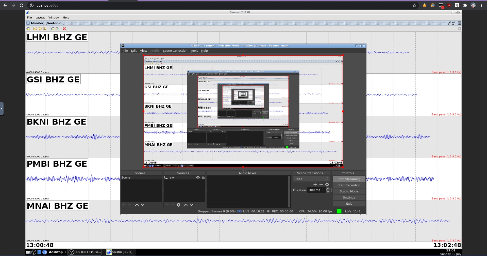

# Docker Swarm

Run Swarm (analyze seismic by usgs), and includes app nautilus,chromium,obs-studio,ffmpeg,vlc for remote monitoring.



## How to Use!

Use docker to run it (VolcanoYT Repo requires a password, please ask me first)

```bash
docker run --rm -it  -p 5901:5901/tcp -p 6080:6080/tcp repo.volcanoyt.com/docker-swarm:last
```

or please build it manually so you can use it without a password :)

```bash
docker build -t "docker-swarm:last" -f Dockerfile .
```

- Web Remote: http://localhost:6080 with password "demo"

## Contributing
Pull requests are welcome. For major changes, please open an issue first to discuss what you would like to change.

Please make sure to update tests as appropriate.

```bash
git clone https://github.com/volcanoyt/Docker-Swarm.git
docker build -t "repo.volcanoyt.com/docker-swarm:last" -f Dockerfile .
docker push repo.volcanoyt.com/docker-swarm:last
```

## Experimental Results
Right now I'm trying to use a cloud server with 90% cpu usage, config like this:

```bash
root@volcanoyt:~# lscpu
Architecture:                    x86_64
CPU op-mode(s):                  32-bit, 64-bit
Byte Order:                      Little Endian
Address sizes:                   39 bits physical, 48 bits virtual
CPU(s):                          4
On-line CPU(s) list:             0-3
Thread(s) per core:              1
Core(s) per socket:              4
Socket(s):                       1
NUMA node(s):                    1
Vendor ID:                       GenuineIntel
CPU family:                      6
Model:                           94
Model name:                      Intel(R) Xeon(R) CPU E3-1245 v5 @ 3.50GHz
Stepping:                        3
CPU MHz:                         3504.003
BogoMIPS:                        7008.00
Hypervisor vendor:               Microsoft
Virtualization type:             full
L1d cache:                       128 KiB
L1i cache:                       128 KiB
L2 cache:                        1 MiB
L3 cache:                        32 MiB
NUMA node0 CPU(s):               0-3
Vulnerability Itlb multihit:     KVM: Vulnerable
Vulnerability L1tf:              Mitigation; PTE Inversion
Vulnerability Mds:               Vulnerable: Clear CPU buffers attempted, no microcode; SMT Host state unknown
Vulnerability Meltdown:          Mitigation; PTI
Vulnerability Spec store bypass: Vulnerable
Vulnerability Spectre v1:        Mitigation; usercopy/swapgs barriers and __user pointer sanitization
Vulnerability Spectre v2:        Mitigation; Full generic retpoline, STIBP disabled, RSB filling
Vulnerability Srbds:             Unknown: Dependent on hypervisor status
Vulnerability Tsx async abort:   Vulnerable: Clear CPU buffers attempted, no microcode; SMT Host state unknown
Flags:                           fpu vme de pse tsc msr pae mce cx8 apic sep mtrr pge mca cmov pat pse36 clflush mmx fxsr sse sse2 ss ht syscall nx lm constant_tsc rep_good nopl cpuid pni pclmulqdq ssse3 fma c
                                 x16 pcid sse4_1 sse4_2 movbe popcnt aes xsave avx f16c rdrand hypervisor lahf_lm abm 3dnowprefetch invpcid_single pti fsgsbase bmi1 hle avx2 smep bmi2 erms invpcid rtm xsaveopt
```

and with real computer 23% cpu usage hmm

```bash
yuki@SiakbaryPC:~$ lscpu
Architecture:                    x86_64
CPU op-mode(s):                  32-bit, 64-bit
Byte Order:                      Little Endian
Address sizes:                   39 bits physical, 48 bits virtual
CPU(s):                          2
On-line CPU(s) list:             0,1
Thread(s) per core:              1
Core(s) per socket:              2
Socket(s):                       1
Vendor ID:                       GenuineIntel
CPU family:                      6
Model:                           158
Model name:                      Intel(R) Core(TM) i3-9100F CPU @ 3.60GHz
Stepping:                        11
CPU MHz:                         3600.000
BogoMIPS:                        7200.00
Hypervisor vendor:               Microsoft
Virtualization type:             full
L1d cache:                       64 KiB
L1i cache:                       64 KiB
L2 cache:                        512 KiB
L3 cache:                        6 MiB
Vulnerability Itlb multihit:     KVM: Vulnerable
Vulnerability L1tf:              Mitigation; PTE Inversion
Vulnerability Mds:               Mitigation; Clear CPU buffers; SMT Host state unknown
Vulnerability Meltdown:          Mitigation; PTI
Vulnerability Spec store bypass: Mitigation; Speculative Store Bypass disabled via prctl and seccomp
Vulnerability Spectre v1:        Mitigation; usercopy/swapgs barriers and __user pointer sanitization
Vulnerability Spectre v2:        Mitigation; Full generic retpoline, IBPB conditional, IBRS_FW, STIBP disabled, RSB filling
Vulnerability Tsx async abort:   Not affected
Flags:                           fpu vme de pse tsc msr pae mce cx8 apic sep mtrr pge mca cmov pat pse36 clflush mmx fxsr sse sse2 ss ht syscall nx pdpe1gb rdtscp lm constant_tsc rep_good nopl xtopology cpuid pni pclmulqdq ssse3 fma cx16
                                  pcid sse4_1 sse4_2 movbe popcnt aes xsave avx f16c rdrand hypervisor lahf_lm abm 3dnowprefetch invpcid_single pti ssbd ibrs ibpb stibp fsgsbase bmi1 avx2 smep bmi2 erms invpcid rdseed adx smap clflushopt
                                  xsaveopt xsavec xgetbv1 xsaves md_clear flush_l1d arch_capabilities

Mem: 2718820K used, 277764K free, 31844K shrd, 120368K buff, 1244644K cached
CPU:  34% usr   3% sys   5% nic  54% idle   0% io   0% irq   0% sirq
Load average: 1.15 1.58 1.42 2/395 4647
  PID  PPID USER     STAT   VSZ %VSZ CPU %CPU COMMAND
   13     1 YUKI     S     670m  23%   1  31% obs --multi --portable --startstreaming
   15    14 YUKI     S    2236m  75%   1   2% java -Duser.country=US -Duser.language=us -jar swarm.jar
    8     1 YUKI     S     171m   6%   1   1% /usr/bin/Xvfb :99 -screen 0 1920x1080x24
    9     1 YUKI     S    45360   1%   1   0% /usr/bin/x11vnc -rfbport 5901 -xkb -noxrecord -noxfixes -noxdamage -display :99              -wait 5 -shared
   25    12 YUKI     S    97020   3%   0   0% {websockify} /usr/bin/python3 /usr/bin/websockify --web /usr/bin/../share/novnc/ 6080 127.0.0.1:5901
   48     1 YUKI     S    35824   1%   0   0% openbox
   45     1 YUKI     S    34900   1%   0   0% tint2
    1     0 root     S    23076   1%   0   0% {supervisord} /usr/bin/python3 /usr/bin/supervisord -c /etc/supervisord.conf
 4577  4572 root     S     2412   0%   1   0% //bin//bash
   12     1 YUKI     S     2260   0%   1   0% bash /usr/bin/novnc_server --listen 6080 --vnc 127.0.0.1:5901
   14     1 YUKI     S     2208   0%   0   0% bash -c cd sw;java -Duser.country=US -Duser.language=us -jar swarm.jar
 4587  4577 root     R     1580   0%   1   0% top
 4572     0 root     S     1576   0%   0   0% //bin//sh -c [ -e //bin//bash ] && //bin//bash || //bin//sh
```

## License
[MIT](https://choosealicense.com/licenses/mit/)